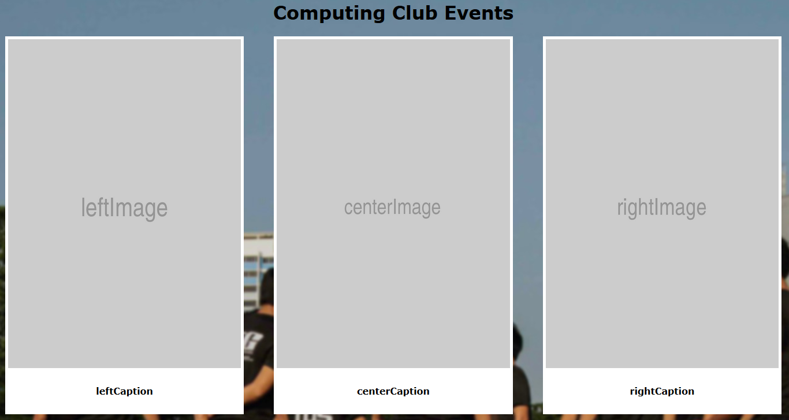

# [NUS Computing Noticeboard Website](http://noticeboard.nuscomputing.com/)

## Updating The Page

1. Prepare three posters to be shown.
2. Upload the posters to either an online image hosting service or to the `img` folder in this repository.
3. References for the posters should be something along the lines of either `img/extensioncord.jpg` or `http://i.imgur.com/nphAPzG.png`.
4. Go to `index.html` and update the references in Line 16 to 23 to your new posters. Please adhere to the syntax of the referencing (i.e. encapsulate the poster reference in quotation marks and end the statement with a semicolon).
5. Refer to the screenshots below for the mapping between the references and the actual appearance of the noticeboard.
6. Contact IT Cell to pull the changes in this repository to the server.

Lines 16 to 23 of `index.html`

Reference map between the variables in `index.html` and the expected appearance of `noticeboard.nuscomputing.com`.